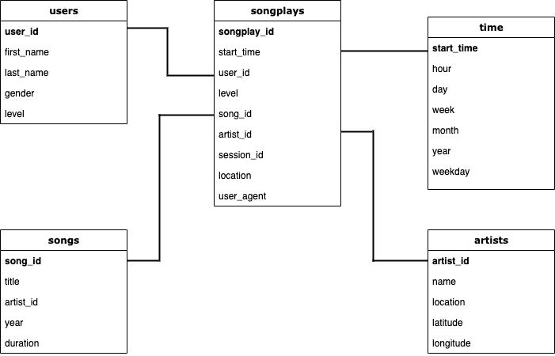

# Data Modeling with Postgres
### **Introduction**

A startup called Sparkify wants to analyze the data they've been collecting on songs and user activity on their new music streaming app. The analytics team is particularly interested in understanding what songs users are listening to. Currently, they don't have an easy way to query their data, which resides in a directory of JSON logs on user activity on the app, as well as a directory with JSON metadata on the songs in their app.

They'd like a data engineer to create a Postgres database with tables designed to optimize queries on song play analysis, and bring you on the project. **Your role is to create a database schema and ETL pipeline for this analysis**. You'll be able to test your database and ETL pipeline by running queries given to you by the analytics team from Sparkify and compare your results with their expected results.

### **Project Description**

In this project, you'll apply what you've learned on data modeling with **Postgres** and build an **ETL pipeline** using **Python**. To complete the project, you will need to define fact and dimension tables for a star schema for a particular analytic focus, and write an ETL pipeline that transfers data from files in two local directories into these tables in Postgres using Python and SQL.

### **Database** Star schema includes:

### **Fact Table**

**songplays** - records in log data assiosiated with song plays
-*songplay_id, start_time, user_id, level, song_id, artist_id, session_id, location, user_agent*
### **Dimension Tables**
 **users** - users in the app
   user_id, first_name, last_name, gender, level
**songs** - songs in music database
   song_id, title, artist_id, year, duration
**artists** - artists in music database
  artist_id, name, location, latitude, longitude
**time** - timestamps of records in **songplays** broken down into specific units
  start_time, hour, day, week, month, year, weekday

### **Files used on the project:**
**`data`** folder with files in JSON format, containing metadata about a song andartists. 
**`create_tables.py`** creates and drops tables.
**`etl.ipynb`** reads and processes JSON metadata from song_data and log_data and loads the data into generated tables.
**`sql_queries.py`** includes sql queries that are utilized in the ETL pipeline.
**`etl.py`** reads and processes files from song_data and log_data and loads them into your tables.
**`test.ipynb`** displays the first few rows of each table to let you check your database.
**`README.md`** provides discussion on my project.
### **ETL Pipeline**
First dataset, song dataset is extracted from Million Song Dataset. Second dataset is generated by event simulator based on the songs in the first dataset. 
The JSON files are read into pandas dataframes, processed and uploaded into the database using psycopg2. - records in log data assiosiated with song plays
